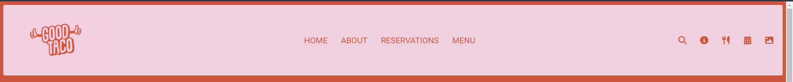
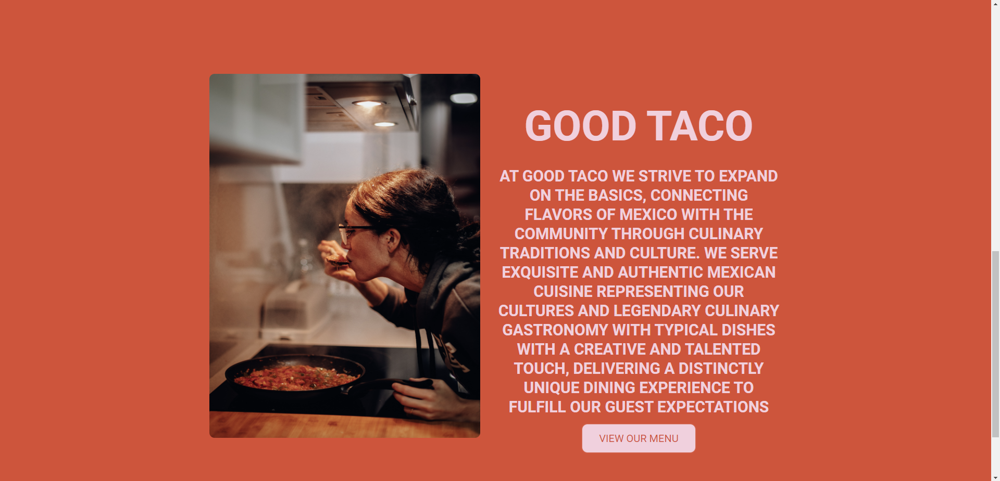
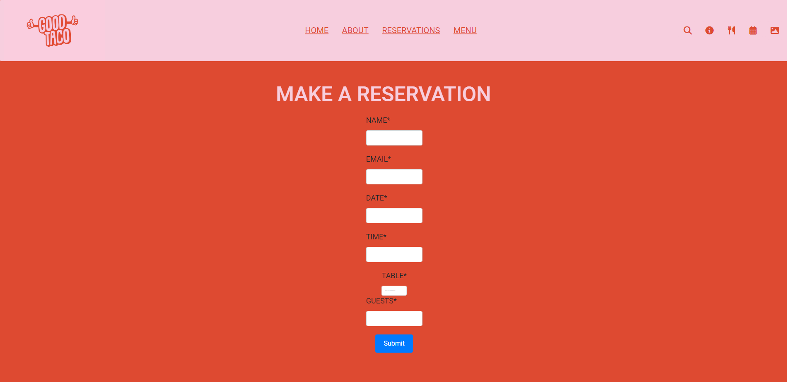
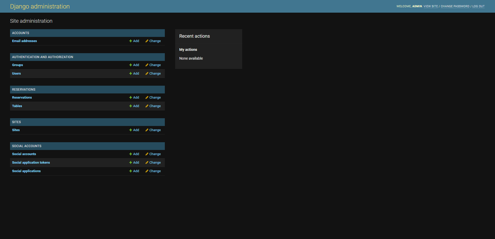

## Good Taco

 Good Taco is a site for a taco resturant. My aim for the site was for customers to get a feel for the resturant, view images, view the menu and reserve a table for a time and date.
---
## [View the deployed website here!](https://goodtaco.herokuapp.com/)
---
## Features 

### Existing Features

- __Navigation Bar__

  - Featured at the top of the page, the full responsive navigation bar includes links to  the Homepage, the Reservations page and the Reservation section to allow for easy navigation to all aspects of the page.
  - This section will allow the user to easily navigate to the section they desire across all devices. 
  - The navigation bar is situated at the top of all pages so the user can easily transition between sections and pages.
  - When clicked the user will be brought to the corresponding place.

- __The About Section__

  - The About section is based on the homepage of the site.
  - This section includes a photograph with a floating About section to give the user some basic information about the resturant. 
  - This section introduces the user to Good Taco with an eye-catching layout to grab the attention of the user.

- __Gallery Page__

  - I created an interactive gallery with an video slider showing videos of food.

- __Reservations Page__

  - The Reservation page gives the user the option to book a table at a said time and date and also the amout of people

- __The Footer__ 

  - The footer is situated on the bottom of all three pages to give the user access to the social media tags.
  - The footer section includes links to the relevant social media sites. The links will open a new tab to the relevant link to allow easy navigation for the user. 
  - The footer is valuable to the user as it encourages them to keep connected via social media.

- __Admin__ 

  - The user will have access to the admin page where they can edit or cancel reservations along eith the tables
  - The Login details are Username + Password = admin

## Deployment

- The site was deployed to GitHub pages. The steps to deploy are as follows: 
  - In the GitHub repository, navigate to the Settings tab 
  - From the source section drop-down menu, select the Master Branch
  - Once the master branch has been selected, the page will be automatically refreshed with a detailed ribbon display to indicate the successful deployment. 

The live link can be found here - [https://goodtaco.herokuapp.com/]

